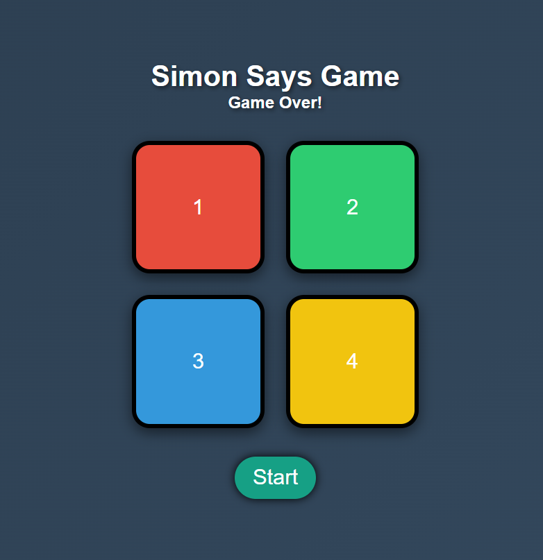

# Simon Says Game 🎮  

A fun and interactive **Simon Says** game built using **HTML, CSS, and JavaScript**.  
Test your memory by repeating the randomly generated sequence of colors!  

🌐 **Live Demo:** [www.niraj.fun](https://www.niraj.fun)  

  

## 🎯 How to Play?  
1. **Press the Start Button** to begin the game.  
2. Watch the **flashing sequence** of colors carefully.  
3. **Click the buttons** in the same order as shown.  
4. If you get it right, the sequence gets **longer** and **faster** each round.  
5. **One mistake and it's Game Over!** Try to beat your high score!  

## ✨ Features  
✅ **Responsive Design** – Works on all screen sizes.  
✅ **Colorful UI & Animations** – Enhanced visuals and effects.  
✅ **Sound Effects** – Each button press has a unique sound.  
✅ **Score Tracking** – Displays current & highest scores.  
✅ **Game Over Effect** – Red flash + shake animation for wrong moves.  

## 📌 Technologies Used  
- **HTML** – Structure  
- **CSS** – Styling & Animations  
- **JavaScript** – Game Logic  

## 🚀 Hosting  
The game is **live and playable** at: [www.niraj.fun](https://www.niraj.fun)  

Enjoy playing and challenge yourself! 😃  
